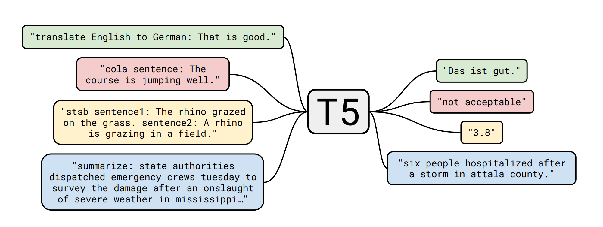
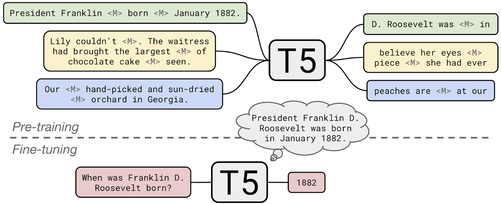
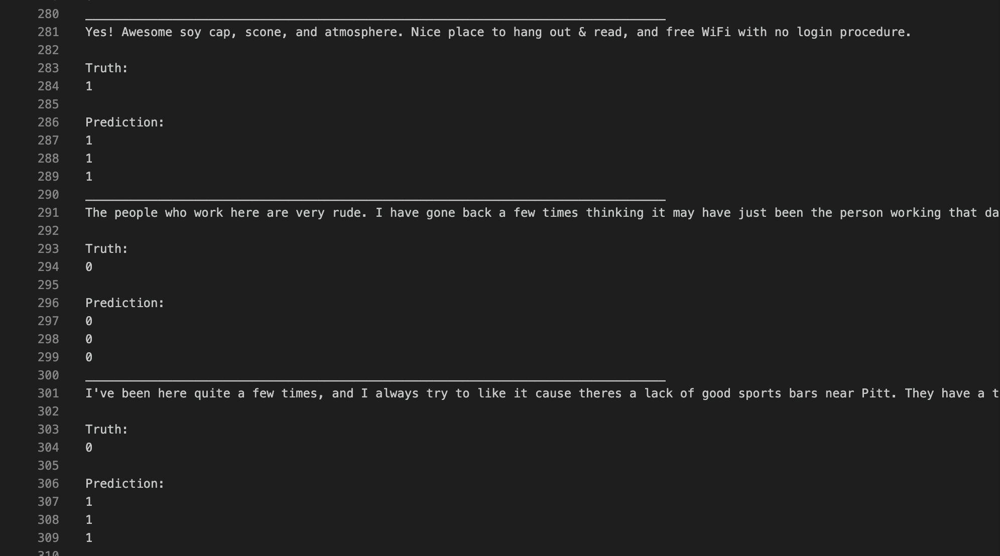
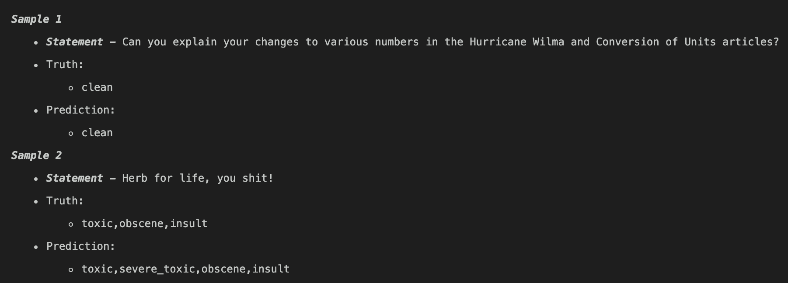
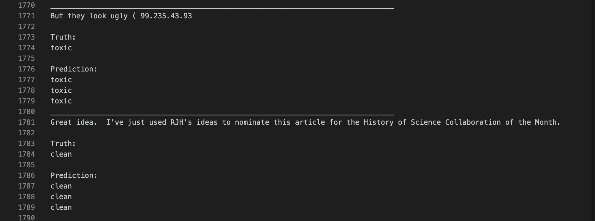
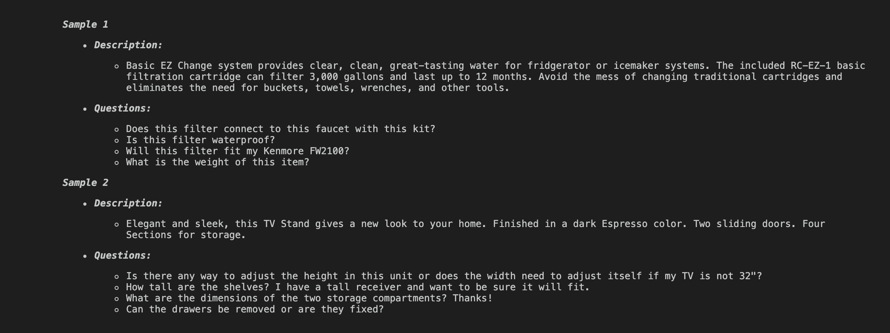
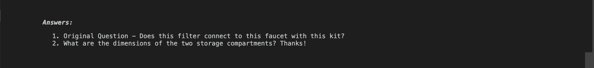

# Transfer Learning with a Unified Text-to-Text Transformer
Implementing the paper [Exploring the Limits of Transfer Learning with a Unified Text-to-Text Transformer](https://arxiv.org/pdf/1910.10683.pdf).   
This was the final course project for the course Neural Networks and Fuzzy logic at BITS Pilani.

## Overview
The ***T5*** (Text-To-Text Transfer Transformer) model was the product of a large-scale study conducted to explore the limits of transfer learning. It builds upon popular architectures like GPT, BERT, and RoBERTa(to name only a few) models that utilized Transfer Learning with incredible success. While BERT-like models can be fine-tuned to perform a variety of tasks, the constraints of the architecture mean that each model can perform only one task.



## Objectives
* [x] Finetune the T5 small/base model on Binary Classification
* [x] Finetune the T5 small/base model on Question Generation on any appropriate dataset of your choice
* [x] Plot the loss curve and accuracy curve of fine-tuning with respect to training steps for Binary Classification
* [x] Calculate the F1 score and Precision for the fine-tuned model on Binary Classification task.
* [x] Calculate the F1 score and Precision for the fine-tuned model on Multilabel Classification task.

## Limitations

Due to unavailability of a high powered TPU, pretraining the T5 model was not possible. So instead, we finished and compiled our finetuning tasks over a variety of NLP tasks.

So what's the difference between finetuning and pretraining anyways? Without getting into the specifics, here's a simple schematic that explains the concept.


## Results

The Question Generation task was a generative one and hence, we figured that the best way would be to evaluate the generated questions on given context with Human Intelligence instead of a hard wired comparison metric.

The evaluation metrics were developed and applied to the classifcation tasks and the results are listed below. 

|             Task            | Model type |     Epochs     | Train Accuracy | Train Loss | Train Precision | Train F1 Score | Test Accuracy | Test Loss | Test Precision | Test F1 score |
|:---------------------------:|:----------:|:--------------:|:--------------:|:----------:|:---------------:|:--------------:|:-------------:|:---------:|:--------------:|:-------------:|
|   Binary Classification     |   T5-Small |  1 (257 Steps) |   0.93974      |   0.10034  |   0.91734       |   0.90763      |   0.92684     |   0.18327 |   0.92898      |   0.92818     |
|   Multilabel Classification |   T5-Small |  1 (200 Steps) |   0.89732      |   0.19565  |   0.92468       |   0.88743      |   0.90857     |   0.09889 |   0.90859      |   0.90803     |
|                             |            |                |                |            |                 |                |               |           |                |               |


## Examples
1. Binary Classification - Developed on Yelp Review Polarity Dataset
    - 1 represents positive
    - 0 represents negative


***
2. Multilabel Classification - Developed on Kaggle's Toxic Comment Classification Dataset



***
3. Question Generation - Developed on Amazon Reviews Dataset(2018)

Try to figure out which one is the original amongst the 4 listed question for given product description!


***
The answers (just in case you did end up making a guess)

***

### Installation and setup


All the necessary instructions are given in the Jupyter Notebooks for the tasks. In case you want to train the model on your own device, please refer to any of the classification notebook.

### Module structure
```
.
├── NNFL_Presentation.pptx
├── Plots       
│   ├── Global_Step_MultiLabel.png
│   ├── Global_Step_QuestionGen.png
│   ├── Learning_Rate_Binary.png
│   ├── Learning_Rate_Multilabel.png
│   ├── Learning_Rate_QuestionGen.png
│   ├── Test_Accuracy_Binary.png
│   ├── Test_Loss_Binary.png
│   ├── Training_Accuracy_Binary.png
│   ├── Training_Loss_Binary.png
│   ├── Training_Loss_MultiLabel.png
│   └── Training_Loss_QuestionGen.png
├── README.md
├── T5_Binary
│   ├── README_BC.md
│   ├── T5_Binary.ipynb
│   ├── plots
│   ├── predictions
│   ├── result.json
│   ├── runs
│   └── wandb
├── T5_MultiLabel
│   ├── Plots
│   ├── README_ML.md
│   ├── T5_MultiLabel.ipynb
│   ├── predictions
│   ├── results
│   ├── runs
│   └── wandb
├── T5_QuestionGen
│   ├── README_QG.md
│   ├── T5_Question_Generation.ipynb
│   ├── plots
│   ├── resource
│   ├── runs
│   └── wandb
├── assets
│   ├── 1_D0J1gNQf8vrrUpKeyD8wPA.png
│   ├── Answer.png
│   ├── Binary.png
│   ├── Extra
│   ├── Multilabel1.png
│   ├── Multilabel2.png
│   ├── Question.png
│   ├── Screenshot\ 2021-04-16\ at\ 3.30.00\ AM.png
│   └── image2.png
└── simple_transformers
    ├── 24-t5-specifics.md
    ├── 25-t5-model.md
    ├── 26-t5-data-formats.md
    ├── 27-t5-minimal-start.md
    ├── __init__.py
    ├── t5_model.py
    └── t5_utils.py
```

### Scripts for running the different modules

You need none! The Jupyter Notebooks are self sufficient in terms of handling the data.
> However, owing to the size constraints of the submission, you will have to download the finetuned models and the training data. The links for task-wise required files has been enclosed in README files in the respective folders.

## Contributing
Feel free to contribute features / point out errors. Fork this repository and make a pull request.  

## References
This project was majorly inspired by the [Simple Transformers Library](https://github.com/ThilinaRajapakse/simpletransformers) by [Thilina Rajapakse](https://github.com/ThilinaRajapakse). The developer has provided a multitude of resources with tips and guides on how to implement the various finetuning and operational tasks of T5. If you are even remotely interested in learning the Transformer Models, I would strongly recommend you to check out the library, which is very well documented and has an excellent supporting blog.

## License
This project is licensed under the [BSD-3](https://opensource.org/licenses/BSD-3-Clause) License
